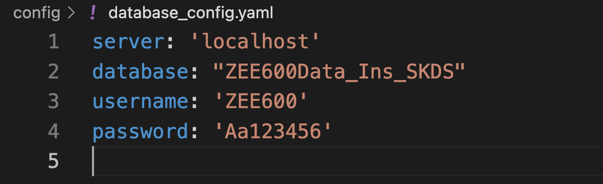

# ABB-project

## Image Recognition - focus on the density of staff in a particular area and how to connect with different databases


### Installation
We provide a simple installation script that, by default, sets up a conda environment with Python 3.9, Pytorch 2.3， and CUDA 12.1 (the CUDA version of ABB-PC, Geforce RTX 4060Ti)

```.bash
source install.sh
```

<font color=blue>If you are using macbook, then use the instruction below to install Pytorch(other steps are same):</font>

```
pip install torch torchvision torchaudio
```

### Quick Start

#### 1. Download Checkpoint

You can download different versions of pretained-yolov8-model:

| Model                                                                                     | size<br><sup>(pixels) | mAP<sup>val<br>50-95 | Speed<br><sup>CPU ONNX<br>(ms) | Speed<br><sup>A100 TensorRT<br>(ms) | params<br><sup>(M) | FLOPs<br><sup>(B) |
| ----------------------------------------------------------------------------------------- | --------------------- | -------------------- | ------------------------------ | ----------------------------------- | ------------------ | ----------------- |
| [YOLOv8n](https://github.com/ultralytics/assets/releases/download/v8.2.0/yolov8n-oiv7.pt) | 640                   | 18.4                 | 142.4                          | 1.21                                | 3.5                | 10.5              |
| [YOLOv8s](https://github.com/ultralytics/assets/releases/download/v8.2.0/yolov8s-oiv7.pt) | 640                   | 27.7                 | 183.1                          | 1.40                                | 11.4               | 29.7              |
| [YOLOv8m](https://github.com/ultralytics/assets/releases/download/v8.2.0/yolov8m-oiv7.pt) | 640                   | 33.6                 | 408.5                          | 2.26                                | 26.2               | 80.6              |
| [YOLOv8l](https://github.com/ultralytics/assets/releases/download/v8.2.0/yolov8l-oiv7.pt) | 640                   | 34.9                 | 596.9                          | 2.43                                | 44.1               | 167.4             |
| [YOLOv8x](https://github.com/ultralytics/assets/releases/download/v8.2.0/yolov8x-oiv7.pt) | 640                   | 36.3                 | 860.6                          | 3.56                                | 68.7               | 260.6             |


#### 2. Run the demo

**To watch the live video:**
```.bash
python demo1.py
```

**To see the result of counting humans:**
```.bash
python demo3.py
```
<font color=blue>P.S. The program will save the counting results of every frame in the video as .txt file in `/runs/detect/`.</font>

#### 3. Insert data to database
To insert data to database, the first step is to confirm the information of the database you want to access。

Edit file: `config/database_config.yaml`



When you set the right parameters of the database, you can now compile the script: `insert_data_to_database.py`

Using instruction:
```.bash
python insert_data_to_database.py
```
#### 4. Adjust accelerator
There are several parameters we need to modify when we plan to use different device. For `Windows` and `Linux` device: you can use `cuda` (if equip) or `cpu`; For `MacBook` device: using `mps`. The parameters are placed in the following scripts:

[File 1](demo1.py#L5)
[File 2](demo3.py#L34)
[File 3](/model/counting_num_of_staff.py#L35)
[File 3](/model/show_live_video.py#L6)